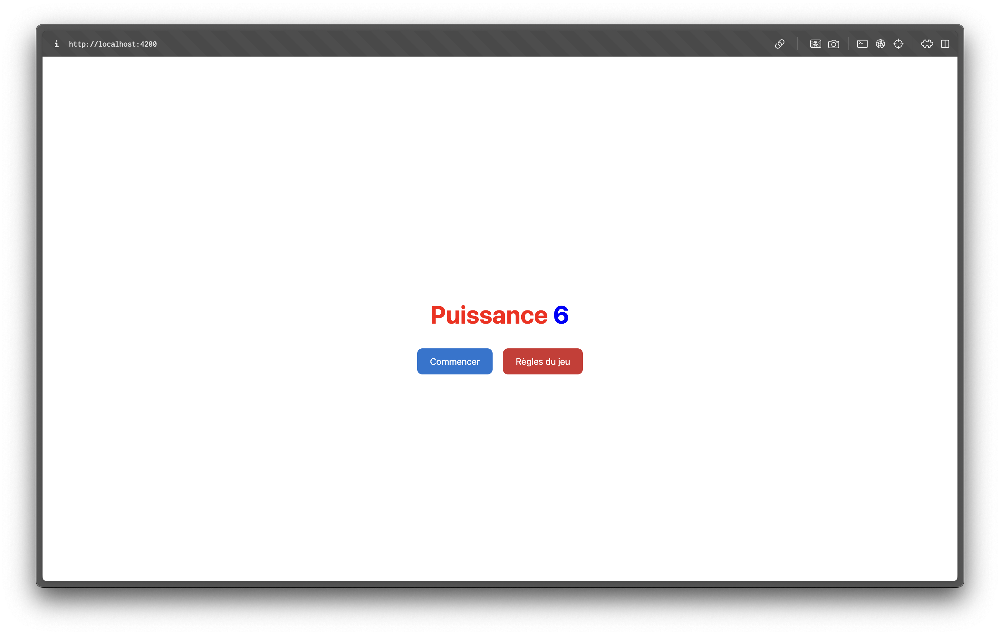
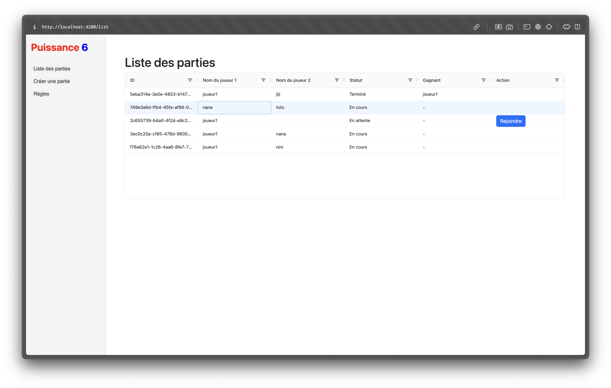
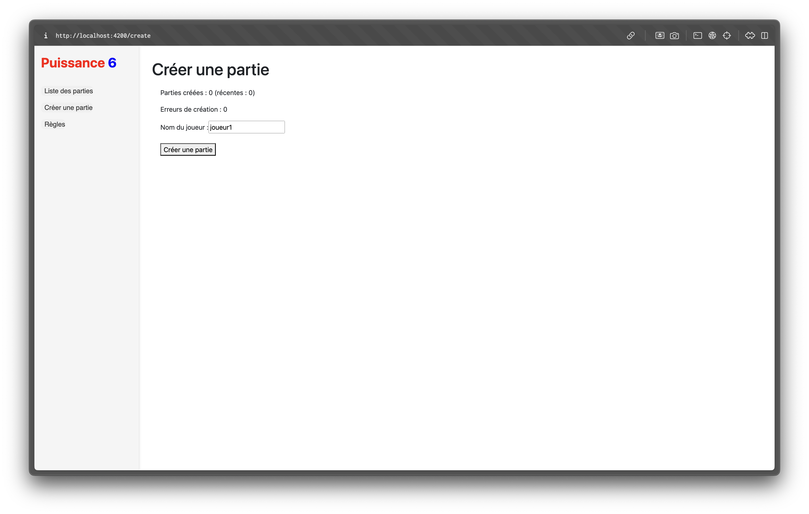
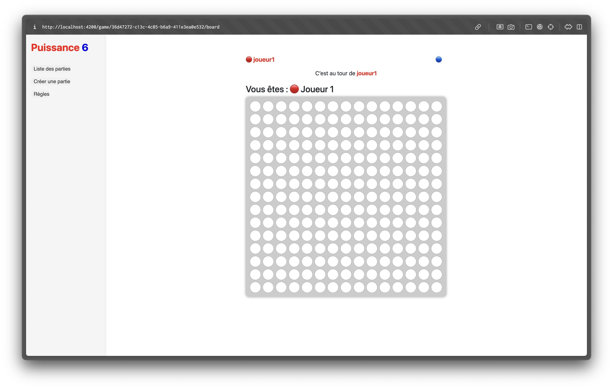
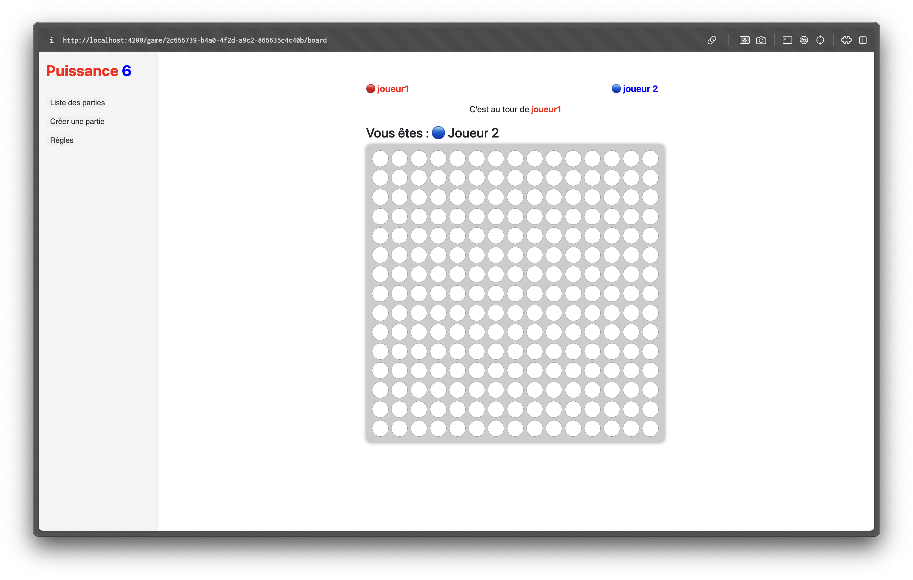
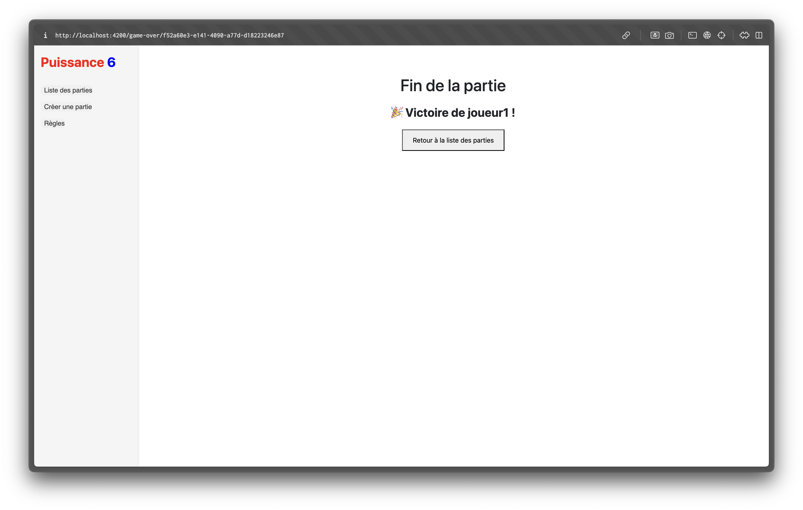
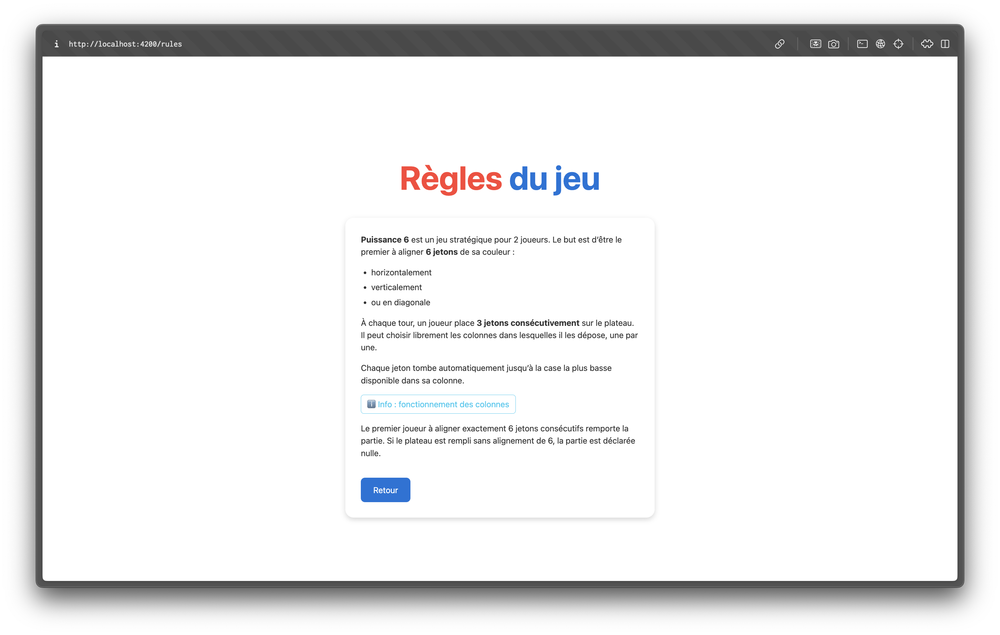

# Puissance 6 - Application Web

Puissance 6 est une application web développée en Angular + Spring Boot permettant à deux joueurs de s'affronter dans une version revisitée du jeu Puissance 4. Le premier à aligner **6 jetons consécutifs** remporte la partie !

---

## 🚀 Fonctionnalités principales

- 🎮 Création et gestion de parties
- 🧠 Tour par tour avec 3 jetons à poser à chaque tour
- 🖥️ Plateau de jeu interactif
- 🧾 Historique des parties
- 📜 Règles du jeu intégrées
- 🔒 Gestion du mot de passe joueur
- ✅ Affichage responsive avec `ng-bootstrap`

---

## ⚙️ Technologies utilisées

| Frontend         | Backend             |
|------------------|---------------------|
| Angular 17       | Spring Boot 3.4     |
| ag-grid          | REST Controller     |
| ng-bootstrap     | Maven               |
| TypeScript       | Java 17             |

---

## 📂 Structure du projet
td-6-in-a-row-game/
├── 
│
├── backend/
│   ├── pom.xml
│   └── src/main/java/com/example/power6game/…
│
├── frontend/
│   ├── angular.json
│   ├── package.json
│   ├── proxy.conf.json
│   └── src/app/…
│
├── .gitignore
└── README.md

---

## 🔌 Lancement du projet en local

### 1. Backend (Spring Boot)

```bash
cd backend
mvn spring-boot:run
```
Accès backend : http://localhost:8080

### 2. Frontend (Angular + proxy vers backend)

```bash
cd frontend
npm install
npm start
```
Accès frontend : http://localhost:4200

Le proxy (proxy.conf.json) redirige /api vers le backend.

---

## 🔗 API REST

| Méthode | URL                            | Description                         |
|--------:|--------------------------------|-------------------------------------|
| `GET`   | `/api/games/list`              | Récupérer toutes les parties        |
| `POST`  | `/api/games/create`            | Créer une nouvelle partie           |
| `POST`  | `/api/games/{id}/join`         | Rejoindre une partie                |
| `GET`   | `/api/games/{id}/state`        | Obtenir l'état d'une partie         |
| `POST`  | `/api/games/{id}/ready`        | Signaler qu'un joueur est prêt      |
| `POST`  | `/api/games/{id}/move`         | Poser un pion dans une colonne      |


## 📸 Captures d’écran

- Accueil (`/`)  
  

- Liste des parties (`/list`)  
  

- Création d’une partie (`/create`)  
  

- Plateau de jeu (`/game/:id/board`)  
  



- Règles du jeu (`/rules`)  
  